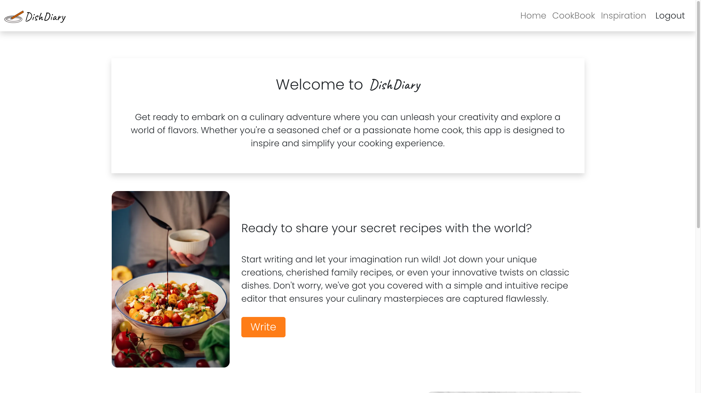
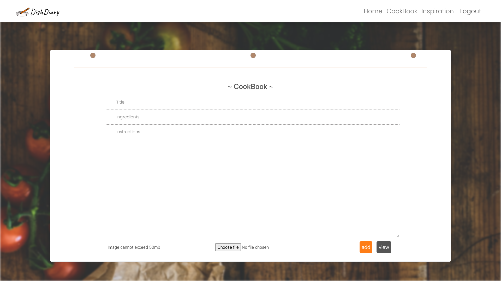
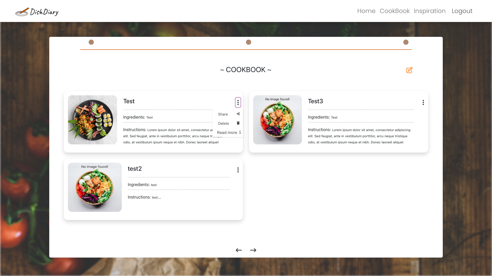
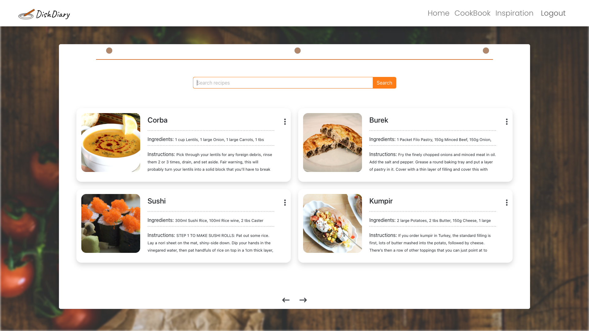

# 🍽️ DishDiary

[Video Demo](https://youtu.be/Xu7Et3H4DX8)

DishDiary is a web application that simplifies the way you manage, share, and explore delicious recipes. 

🌟 Features


Recipe Management: Create and organize recipes with a user-friendly interface.

Image Upload: Easily upload images of culinary creations to accompany recipes.

Recipe Sharing: Share recipes with the world and discover new culinary ideas.

User Authentication: Secure login and registration process with JWT token-based authentication.

Responsive Design: DishDiary is fully responsive for both mobile and desktop users.


💻 Technologies


Frontend: HTML, CSS, Bootstrap, JavaScript, React

Backend: Python, Flask

Database: SQLAlchemy (Database ORM)

Authentication: JWT (JSON Web Tokens)

Images taken from www.unsplash.com






🚅 Live Demo


Check out the live demo of DishDiary at here. Explore its features, try out some recipes, and see how DishDiary can elevate your cooking experience.

Enjoy your cooking adventures with DishDiary, and never let your cooking inspiration run dry! 🍳🍰🍔🥗🥂


## 🚀 Getting Started


To run DishDiary on your local machine, follow these simple steps:

### Backend Setup

1. Install Pipenv:

```bash
pip install pipenv
```

2. Create a virtual environment with Pipenv and install the Python dependencies:

```bash
pipenv install
```
3. Activate the virtual environment:

```bash
pipenv shell
```

### Frontend Setup

1. Navigate to the client directory:

    ```bash
    cd client
    ```

2. Install JavaScript dependencies:

    ```bash
    npm install
    ```